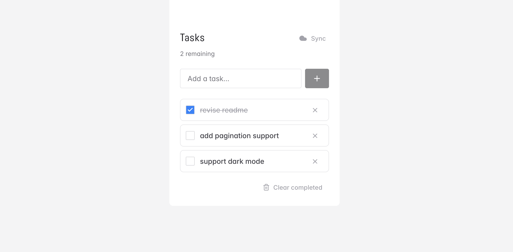

# Todo App

A privacy-focused, offline-first task manager built with React and TypeScript. Instead of storing data on a central server, it uses the [remoteStorage](https://remotestorage.io) open protocol to let users sync across devices through their own storage account.

**Live demo:** [rockacola.github.io/todo-app](https://rockacola.github.io/todo-app)



## Tech Stack

**Frontend:** React 19, TypeScript 5.9, Chakra UI 3, Emotion  
**Build:** Vite 8  
**Testing:** Vitest, React Testing Library, jsdom  
**Sync:** remotestoragejs (IndexedDB + WebDAV-based cloud sync)  
**Quality:** ESLint 9 (flat config, 92 rules), Prettier

## Architecture

```text
┌─────────────────────────────────────────────┐
│                  React UI                   │
│  (Chakra UI components, responsive layout)  │
├──────────────────┬──────────────────────────┤
│   useTodos()     │   useRemoteStorage()     │
│   CRUD + state   │   connection + sync      │
├──────────────────┴──────────────────────────┤
│         remoteStorage module                │
│   (JSON Schema, IndexedDB cache, sync)      │
├─────────────────────────────────────────────┤
│    Local (IndexedDB)  ⇄  Remote (WebDAV)    │
└─────────────────────────────────────────────┘
```

- **Components** handle rendering and user interaction only
- **Custom hooks** (`useTodos`, `useRemoteStorage`) encapsulate all business logic and side effects
- **remoteStorage module** defines the data schema and provides typed CRUD operations with caching
- Data syncs via change events. Local edits persist immediately to IndexedDB, then replicate to the user's remote storage when connected

## Key Features

- **Offline-first**: works without network, data cached in IndexedDB
- **User-owned data**: syncs to the user's own remoteStorage account, not a third-party server
- **Cross-device sync**: connect a remoteStorage address to keep todos in sync across devices
- **Sync status UI**: cloud icon shows connection state, overlay spinner during active sync
- **Keyboard accessible**: full keyboard navigation, ARIA labels, semantic HTML
- **Responsive layout**: adapts from mobile to desktop via Chakra UI breakpoints

## What This Demonstrates

| Skill                  | Where it shows                                                                  |
| ---------------------- | ------------------------------------------------------------------------------- |
| **React architecture** | Clean separation of UI components and business logic hooks                      |
| **TypeScript**         | Strict config, full type coverage, branded interfaces, type guards              |
| **State management**   | Event-driven sync with useCallback, useEffect cleanup, immutable updates        |
| **Testing**            | Component + hook tests with proper mocking strategies (vi.mock, act, userEvent) |
| **API integration**    | Custom remoteStorage module with JSON Schema validation and conflict handling   |
| **Code quality**       | 92 ESLint rules, Prettier, consistent patterns across the codebase              |
| **Accessibility**      | ARIA attributes, semantic elements, keyboard support                            |
| **Modern tooling**     | Vite 8, ESLint flat config, Vitest with v8 coverage                             |

## Getting Started

### Prerequisites

- Node.js 20+

### Install and run

```bash
git clone https://github.com/rockacola/todo-app.git
cd todo-app
npm install
npm run dev
```

Open [http://localhost:5173](http://localhost:5173). You should see the task manager UI.

### Optional: enable cloud sync

1. Get a free remoteStorage address at [5apps.com/storage](https://5apps.com/storage)
2. Click the cloud icon next to "Tasks" in the app
3. Enter your remoteStorage address and authorise

### Available scripts

| Script                  | Description                    |
| ----------------------- | ------------------------------ |
| `npm run dev`           | Start dev server               |
| `npm run build`         | Type-check + production build  |
| `npm run preview`       | Serve production build locally |
| `npm test`              | Run tests                      |
| `npm run test:coverage` | Run tests with coverage report |
| `npm run lint`          | Lint with ESLint               |
| `npm run format`        | Format with Prettier           |

## Project Structure

```text
src/
├── components/        # UI components (AddTodoForm, TodoItem, TodoList, etc.)
├── hooks/             # Business logic (useTodos, useRemoteStorage)
├── lib/               # remoteStorage module definition and initialisation
├── types/             # TypeScript type definitions
└── test/              # Test setup and utilities
```

## Future Improvements

- Expanded remoteStorage documentation and usage guide
- Touch gesture controls (swipe to complete/delete)
- User preference settings synced via remoteStorage
